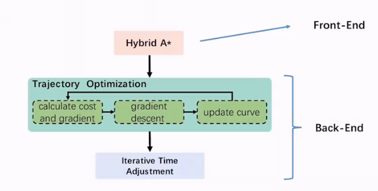

  

 

Hybrid A* : Primitives Generation

用三个独立的一维时间参数化多项式函数表示轨迹
$$
\mathbf{p}(t):=\left[p_{x}(t),p_{y}(t),p_{z}(t)\right]^{\mathrm{T}}\\
p_{\mu}(t)=\sum_{k=0}^{K}a_{k}t^{k},\mu\in\{x,y,z\}
$$
从四旋翼系统的角度来看，它对应于线性时不变（LTI）系统
$$
\text{state vector:} \quad \mathbf{x}(t) := \left[ \mathbf{p}(t)^T, \dot{\mathbf{p}}(t)^T, \dots, \mathbf{p}^{(n-1)}(t)^T \right]^T \subset \mathbb{R}^{3n}\\
\text{control input:} \quad \mathbf{u}(t) := \mathbf{p}^{(n)}(t) \in \mathcal{U} := [-u_{\max}, u_{\max}]^3 \subset \mathbb{R}^3
$$
Hybrid A* : Actual Cost

我们关注轨迹能否得到最优的时间和控制，因此可以定义代价函数：

Hybrid A* : Heurisitic Cost

