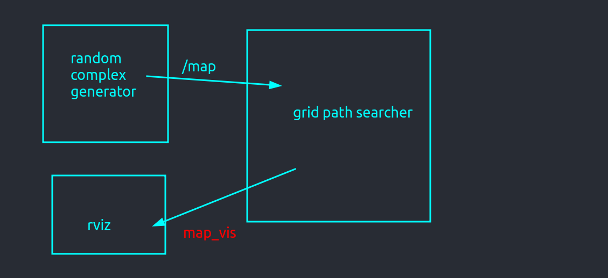
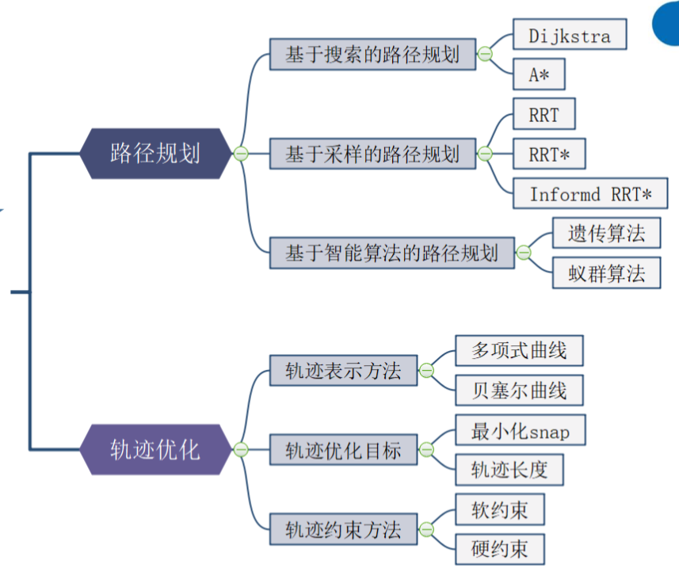
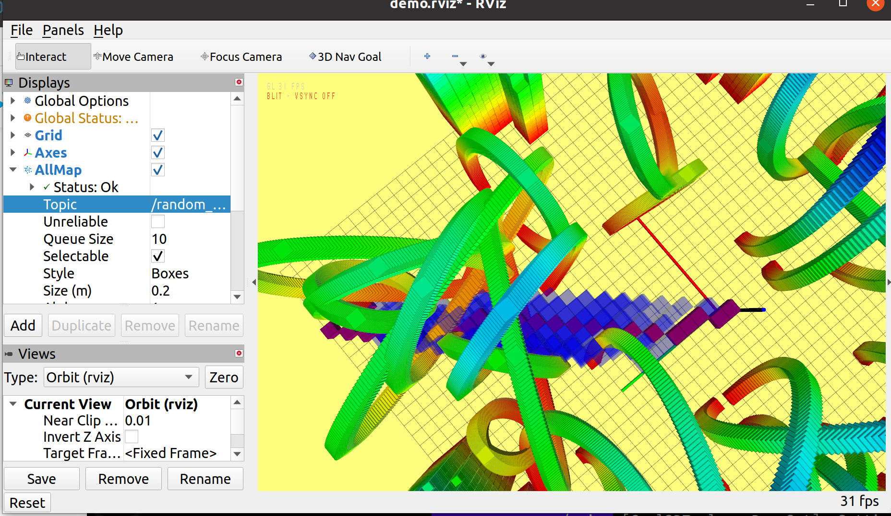
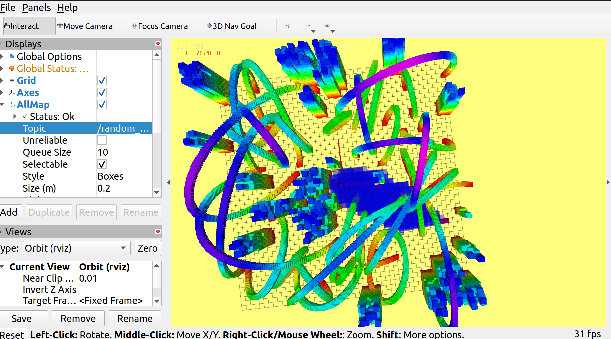
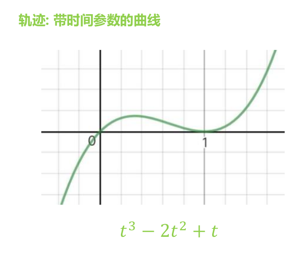

ros 作业包数据流图：



---

# 路径规划算法总结

评估算法指标：

- **完备性**：如果在起始点和目标点间有路径解存在，那么一定可以得到解，如果得不到解那么一定说明没有解存在；
- **概率完备性**：如果在起始点和目标点间有路径解存在，只要规划或搜索的时间足够长，就一定能确保找到一条路径解；
- **最优性**：是指规划得到的路径在某个评价指标上是最优的（评价指标一般为路径的长度）；
- **渐进最优性**：经过有限次规划迭代后得到的路径是接近最优的次优路径，且每次迭代后都与最优路径更加接近，是一个逐渐收敛的过程；

  


# A* 搜索算法

Tie Breaker

在某些地图中,存在着相同耗散值的路径(Arthur1989注:下文中一律称为平局).比如说,在没有凹凸的平原中,使用栅格将会得到许多路径,他们长度是一样的.A*也许会遍历所有的拥有一样的f值的路径,而不是仅仅遍历一条.(如果你的地图中有很多这样的区域,比起A*算法,对于每个栅格的搜索有其他更好的技巧.)

设 dx = |Δx|, dy = |Δy|（格子索引差的绝对值）

```
h = D * (dx + dy) + (D2 - 2*D) * min(dx, dy)
```

参数说明与可用值

- D = 直行一步的代价（通常为 resolution）。
- D2 = 对角一步的代价（例如 2D 平面上 sqrt(2) * resolution）。
  当 D2 = sqrt(2)*D 时，上式就变成常见的 8-连通对角启发式。

正确性/性质

- 若 D2 与 D 与实际格子移动代价一致，该启发是 admissible（不高估最短距离）且通常是 consistent（单调）的，能让 A* 效率更高（比曼哈顿或纯欧式更贴切允许对角移动的代价分布）。


扩展，三维的Diagonal Distance


使用了DIagonal 的Heuristic：



使用了Euclidean的Heuristic




JPS （Jump Point Search）

其实就是一种系统性的实现Tie Breaker 图搜索方法

JPS本质：用更强的扩展规则把多步“压缩”为一个跳跃（jump），因此Open List中的节点数通常比普通A*少很多

代价是：每次从一个节点“跳”到下一个跳点时，需要沿路径检查很多格子（jump里递归/循环调用 isFree/isOccupied,hasForced 等），这些叫 “status query”

因此时间开销 = 少量节点*每个节点更多的查询  ，能否加速取决于两者的平衡

- 大开阔且障碍稀疏的地图：跳跃很远、每次查询相对少且有价值，JPS优势明显

  > 跳跃带来的开销 vs 访问openlist的时间开销
  >
  > JPS 减少的是被加入/弹出的节点数（open-list 的节点），而不是每次跳跃的格子检查数。若减少的 open-list 操作和展开节点带来的开销远大于每次跳跃额外的格子检查，JPS 就更快；反之则不一定

- 在狭窄、复杂或障碍密集的环境：跳跃被频繁中断/退化 为短跳或很多回溯，查询成本高，JPS反而慢或与A*相当

对有限视野（limited FOV）或局部地图的机器人：JPS 假设对长直线段的连通性可知；若地图只是局部、动态或不完整，jump 会反复遇到未知/动态格子，造成大量无效查询或错误判断 → 不适合用 JPS。

在三维（3D）场景里 JPS 的规则和 forced-neighbor 判定更复杂，查询数量爆增，收益更不确定。


# RRT 算法

通过调用ompl来实现RRT，需要功能：将用户定义的起点、终点、地图 用ompl库定义的数据结构表示

了解ompl 调用RRT 的方法和步骤

把ompl库求解得到的路径转换为用户定义的数据结构


---

PCL库相关

在PCL中，width 和 height 描述点云的数据组织方式：

- 非组织（unorganized）点云：height =1，width = 点数（points.size()）这是“点集合”形式
- 组织（organized）点云：height>1，width = 每行点数，(points.size() == width * height),等同于一个二维阵列，可以用(col,row)二维索引访问

---

# 轨迹优化

轨迹：**带时间参数的曲线**

  

## 最优化问题

寻找一个容许控制u,使得被控对象按照技术要求运行，并使给定的性能指标达到最优值

反馈控制的性能指标满足所期望的要求即可；而最优控制的性能指标不仅满足期望要求，还要取得最优值

最优控制的基本内容：经典变分法、极小值原理、动态规划

从数学观点来看，最优控制问题就是求解一类带有约束条件的 泛函极值 问题


关于变分：

I 称为 y(x)的泛函，其是关于 y(x)和其一阶导数y'(x)的函数，我们期望找到一个具体的y(x),使得I有极值（极大或极小）

注意一般的极值问题中，我们考察的是自变量x的变化：x取值多少时，函数会有极值

而现在这个新问题的不同之处，我们考察的是函数y(x)的变化：y(x) 是什么形式时，I会有极值

Euler-Lagrange （第一变分为0）只给出驻值（stationary条件）

要判定是否为最小，需要看第二变分（相当于一元函数的二阶导数测试）或用更强的充分条件

通常来讲：**Euler-Lagrange** 方程会是一个**二阶的微分方程**，y(x) 的**通解中含有的两个待定常数**刚好可以**通过两个边界条件**确定


example: 两点间的最短路径

condition：给定平面上两点(a,p) 和 (b,q)

purpose: 连接两点曲线最短

思路：

使用Euler-Lagrange 方程来寻找可以让 S有极小的函数 y(x)


## 多项式轨迹


